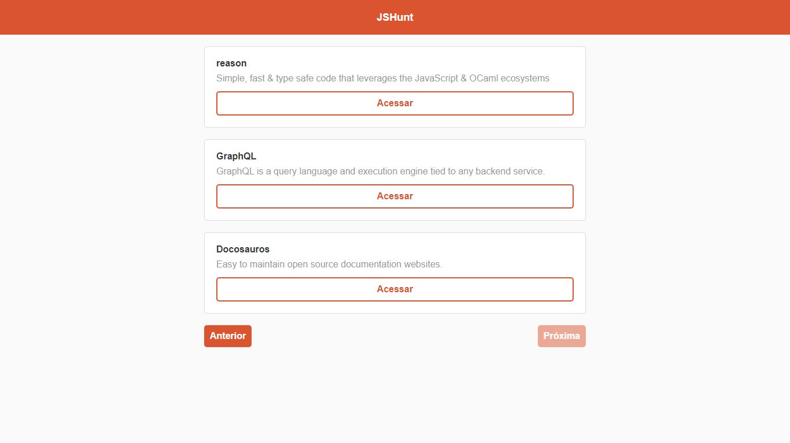

### JSHunt

> Projeto realizado acompanhando "Starter - ReactJS" do curso introdutório ofertado pela [RocketSeat](https://skylab.rocketseat.com.br/journey/starter).

Projeto realiza listagem de produtos e visualização de um único produto, consumindo uma API disponibilizada pelo próprio o curso.

Exemplo:
